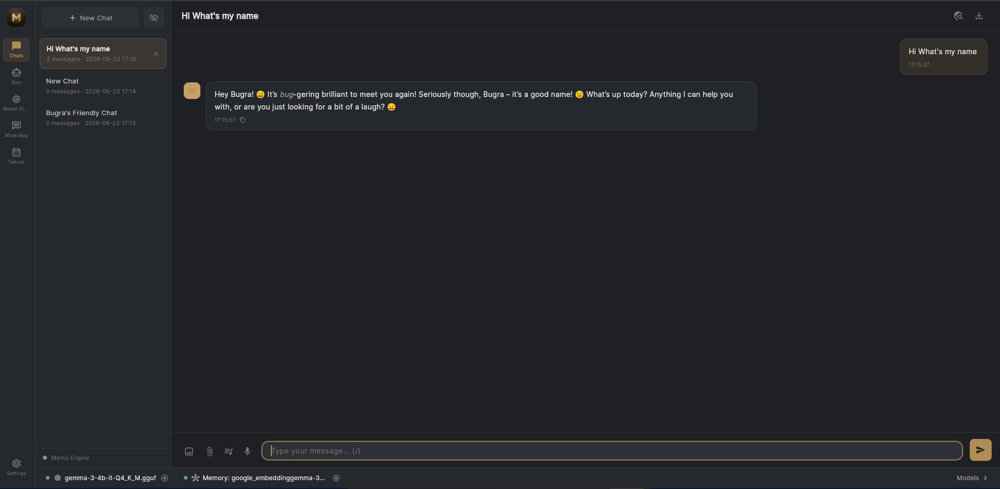
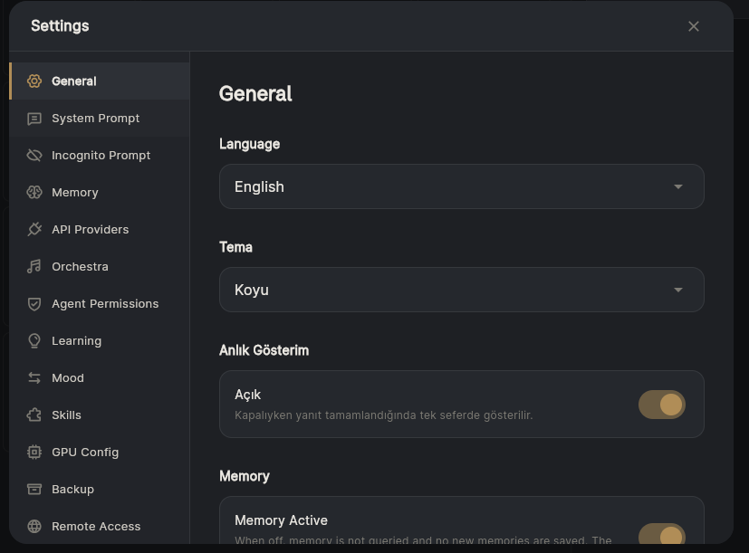
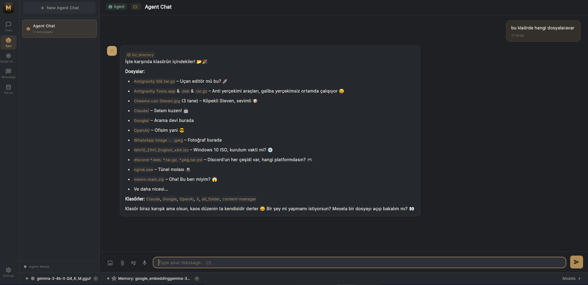
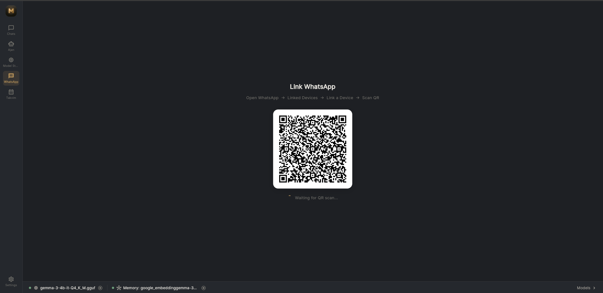
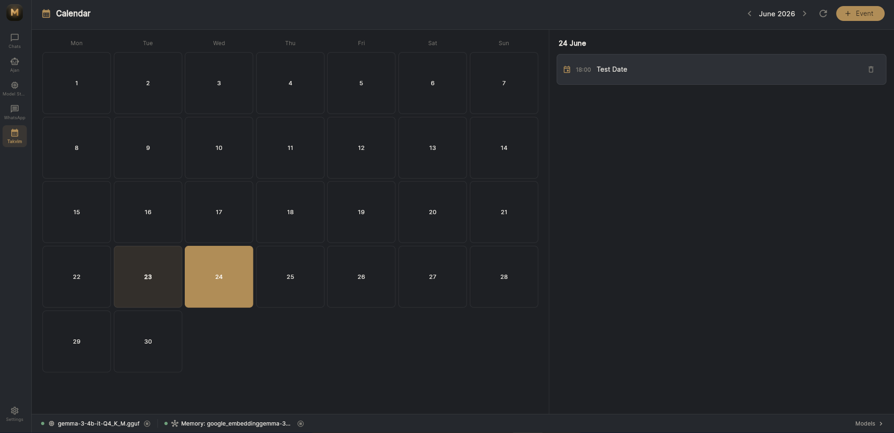
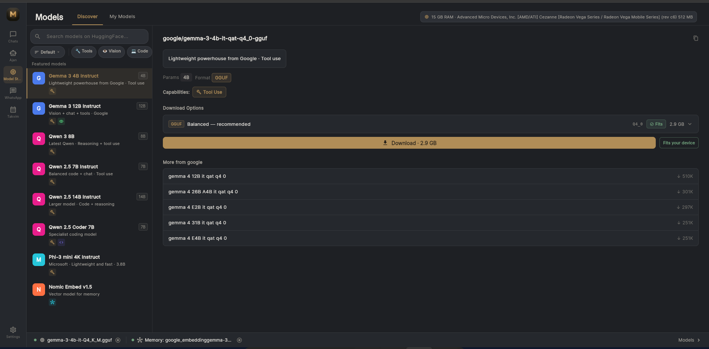
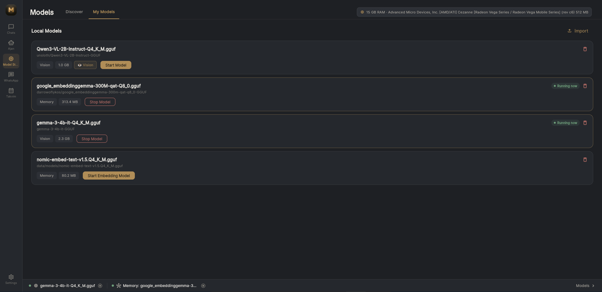

<div align="center">

  

  <h1>Memo</h1>

  <h3>The local AI that remembers everything — and acts before you ask.</h3>

  <p><sub><b>100% Local</b> · <b>Privacy-First</b> · <b>Zero Cloud Dependency</b> · <b>Fully Offline</b></sub></p>

  <br/>

  <a href="https://memo.bugradev.com"></a>
  <a href="https://memocpp.com/guide"></a>
  <a href="https://github.com/BugraAkdemir/memo/stargazers"></a>
  
  

  <br/><br/>

  
  
  
  
  
   
  

  <p><b><a href="READmeTR.md">🇹🇷 Türkçe için tıkla</a></b></p>

</div>

---

<div align="center">

### Every other AI forgets you the moment you close the tab.<br/>Memo doesn't.

</div>

It runs entirely on **your** machine. It remembers conversations from weeks ago. It learns *when* you work and quietly gets ready before you do. And when you ask it to actually **do** something — edit a file, run a command, message someone on WhatsApp — it does it.

No cloud. No subscription. No telemetry. Your mind stays yours.

<div align="center">
  <br/>
  <h3>🎬 Watch the Agent actually do the work</h3>
  <video src="https://raw.githubusercontent.com/BugraAkdemir/memo/main/docs/assets/videos/agent.mp4" controls width="80%"></video>
  <p><sub>Reading files, running shell commands, writing code — live, sandboxed, permission-gated.<br/><a href="https://raw.githubusercontent.com/BugraAkdemir/memo/main/docs/assets/videos/agent.mp4">▶ Tap to play if the preview doesn't load</a></sub></p>
</div>

---

## Memo vs. Every Other Assistant

|  | 🤖 Typical AI Assistant | 🧠 **Memo** |
|---|:---:|:---:|
| **Memory** | Forgets when the tab closes | Remembers for **weeks** (local RAG) |
| **Your data** | Sent to the cloud | **Never leaves your machine** |
| **Works offline** | ❌ | ✅ |
| **Takes real actions** | Generates text only | Edits files, runs commands, messages |
| **Learns your habits** | ❌ | ✅ Proactive engine |
| **Cost** | Monthly subscription | **Free & open source** |

---

## The Three Things That Make Memo, Memo

<table>
<tr>
<td align="center" width="33%">
  <h3>🧠 It Remembers</h3>
  <p>Every chat is embedded into a local vector database. Mention a project from three weeks ago and Memo already has the context.</p>
  <sub><a href="#-immortal-rag-memory">How →</a></sub>
</td>
<td align="center" width="33%">
  <h3>📊 It Learns</h3>
  <p>A background observer learns your rhythms. After a week it knows when you code, plan, or take breaks — and anticipates.</p>
  <sub><a href="#️-proactive-learning-engine">How →</a></sub>
</td>
<td align="center" width="33%">
  <h3>⚡ It Acts</h3>
  <p>8 real tools in a secure sandbox: read/write files, run commands, search the web, message WhatsApp. You approve each step.</p>
  <sub><a href="#-the-agent-engine">How →</a></sub>
</td>
</tr>
</table>

---

## ✨ Features

### 💬 A Chat That Feels Alive

<table>
<tr>
<td width="62%">

Streaming token-by-token responses with full Markdown — syntax-highlighted code blocks, tables, images. Drop in a file (text, PDF, code) or an image and Memo reads it. Hit `/` for the slash-command palette, or press-and-hold the mic for **on-device** voice input via whisper.cpp.

Switch language mid-sentence and it follows you. Toggle web search and every reply is enriched with live results — **no API key, no setup.**

</td>
<td align="center" width="38%">
  
</td>
</tr>
</table>

---

### 🧠 Immortal RAG Memory

<table>
<tr>
<td width="62%">

Every exchange is embedded into a **768-dimension vector** and stored in SQLite with `sqlite-vec` ANN indexing. Ask something new and Memo pulls the most relevant past conversations and injects them into the prompt — so the model already knows.

**No Pinecone. No embeddings API. No cloud vector DB.** Just SQLite and your GPU. This is the difference between an assistant that *knows* you and one that meets you for the first time, every single time.

</td>
<td align="center" width="38%">
  
</td>
</tr>
</table>

> **🎬 Watch Memo recall who you are — across sessions:**

<div align="center">
  <video src="https://raw.githubusercontent.com/BugraAkdemir/memo/main/docs/assets/videos/whats-my-name.mp4" controls width="80%"></video>
  <p><sub><a href="https://raw.githubusercontent.com/BugraAkdemir/memo/main/docs/assets/videos/whats-my-name.mp4">▶ Tap to play if the preview doesn't load</a></sub></p>
</div>

---

### 🤖 The Agent Engine

<table>
<tr>
<td width="58%">

Point Memo at a project folder and it stops talking and starts **doing** — reading, writing, editing, deleting files; listing directories; running shell commands; searching the web. **8 built-in tools** inside a sandbox with path validation, symlink protection, and a command blacklist.

Every tool call asks first. Allow or deny **once, for the session, or forever.** Up to 20 iterations per task, a 60s timeout per tool, cancel anytime. It feels like Claude Code or Cursor — minimal, informative, never noisy.

</td>
<td align="center" width="42%">
  
</td>
</tr>
</table>

---

### 📱 Deep WhatsApp Integration

<table>
<tr>
<td width="58%">

Connect with a QR code — same protocol as WhatsApp Web, **no Business API fees.** Read, search, and reply to messages right inside Memo, in a UI that matches its bronze theme.

The agent can send messages and resolve contacts by name — just say *"message Berra"*, no JID needed. And every WhatsApp conversation feeds the same memory, observer, and calendar pipelines as normal chat.

</td>
<td align="center" width="42%">
  
</td>
</tr>
</table>

---

### 📅 Smart Calendar — It Schedules Itself

<table>
<tr>
<td width="58%">

You never fill out a form. A two-stage pipeline scans every message for time patterns (*"tomorrow"*, *"next Tuesday"*, *"at 3pm"*), and only matching messages reach an LLM that extracts a structured event.

Reminders fire on desktop and mobile. Said something vague like *"maybe tomorrow?"* — Memo creates an ambiguity event you confirm with one tap. Atomic SQL transactions guarantee a reminder never fires twice.

</td>
<td align="center" width="42%">
  
</td>
</tr>
</table>

> **🎬 A plan mentioned in chat becomes a calendar event — automatically:**

<div align="center">
  <video src="https://raw.githubusercontent.com/BugraAkdemir/memo/main/docs/assets/videos/calendar.mp4" controls width="80%"></video>
  <p><sub><a href="https://raw.githubusercontent.com/BugraAkdemir/memo/main/docs/assets/videos/calendar.mp4">▶ Tap to play if the preview doesn't load</a></sub></p>
</div>

---

### 👁️ Proactive Learning Engine

Memo is the only assistant that comes to **you**. A background observer tracks *when* you're active — never what you say. Using **circular (directional) statistics**, it finds rhythms like *"Mondays 9–10am, planning"* or *"Daily 9pm–11pm, coding."*

When confidence crosses a threshold, it decides: suggest something helpful, push a notification, or — at high confidence — auto-start the agent. It's opt-in, transparent, and patterns that fade are forgotten. It stores **only topic labels and timestamps — never your raw text.**

> **🎬 The Mood Engine & opt-in Self-Interest protocol in action:**

<div align="center">
  <video src="https://raw.githubusercontent.com/BugraAkdemir/memo/main/docs/assets/videos/moods-and-ozc%C4%B1kar.mp4" controls width="80%"></video>
  <p><sub><a href="https://raw.githubusercontent.com/BugraAkdemir/memo/main/docs/assets/videos/moods-and-ozc%C4%B1kar.mp4">▶ Tap to play if the preview doesn't load</a></sub></p>
</div>

---

### 🏪 Curated Model Store

<table>
<tr>
<td width="62%">

Finding the right model is usually a maze of HuggingFace repos and cryptic filenames. Memo fixes that. It detects your GPU and RAM, then tags every download with a **hardware-fit badge**: *"Fits your device — fast on GPU"*, *"Runs (CPU)"*, or *"Too large."*

Plain-language quality labels replace quant codes — *"Balanced quality"* instead of `Q4_K_M`. Real company logos, capability filters (Tools / Vision / Code), and a one-click Start that auto-configures GPU offloading. No more guessing.

</td>
<td align="center" width="38%">
  
  <br/><br/>
  
</td>
</tr>
</table>

---

### 🎵 Orchestra — A Team of Models

A **Chief** model decomposes a complex task and delegates to 8 specialist roles, then synthesizes the result. Mix providers freely — Claude for reasoning, Gemini for speed, local llama.cpp for code. Independent roles run in **parallel**. Combine it with the Agent and the Chief plans while the Agent executes, step by step.

| Planner | Frontend | Backend | Bug Fixer | Reviewer | Security | DevOps | Generalist |
|:---:|:---:|:---:|:---:|:---:|:---:|:---:|:---:|

---

### 🔌 8 Providers · 🎤 Voice · ☁️ Cloud Sync · 🔒 Privacy

- **8 Providers, One Interface** — OpenAI, Claude, Gemini, Grok, Groq, OpenRouter, Ollama, and bundled `llama.cpp`. Auto-fallback on failure, auto-disable after 3 errors, live `/model` switching mid-chat. Keys encrypted with AES-256-GCM.
- **🖥️ Coding Agent as a Provider (Beta)** — point any single chat at your locally installed **Claude Code** or **Codex CLI** instead of an API. That chat becomes a real coding agent with file/shell access, running in the background independent of whatever else you're doing in Memo — while every other chat keeps using its own provider, untouched.
- **🎤 Voice Input** — on-device whisper.cpp. Press, speak, release. Auto-detects TR/EN. Audio never leaves your machine.
- **☁️ Cloud Sync** — optional E2E-encrypted Google Drive backup. AES-256-GCM + PBKDF2 (600K iterations). Encrypted *before* upload — Google can't read it.
- **🔒 Privacy by Design** — no telemetry, no analytics, no crash reporting. Config files at `0600`. Incognito mode leaves zero trace. The observer stores activity timestamps, never message content.

---

## 🚀 Quick Start

**No terminal needed. No build steps. `llama.cpp` and engine binaries are bundled.**

### One-line install

| Platform | Command |
|----------|---------|
| **Linux / macOS** | `curl -fsSL https://download.bugradev.com/get-memo.sh \| bash` |
| **Windows** | `irm https://download.bugradev.com/get-memo.ps1 \| iex` |

<details>
<summary><b>📦 What the installer does</b></summary>
<br/>

- Installs the CLI (`memo`) on your PATH — run it from any terminal
- Installs the Flutter desktop app — find **Memo** in your app menu
- Copies engine binaries (`llama-server`, `vec0`) — GPU-ready
- Seeds default configs — never overwrites your existing settings
- Safe to re-run — only binaries are refreshed on subsequent runs

</details>

### Update / Uninstall

```bash
# Re-run the installer — auto-detects existing install and updates instead
curl -fsSL https://download.bugradev.com/get-memo.sh | bash
# Or use the dedicated updater
curl -fsSL https://download.bugradev.com/update.sh | bash
# Uninstall (optionally backs up your memory first)
curl -fsSL https://download.bugradev.com/uninstall.sh | bash
```

### Alternative: manual download

Download the latest release from **[memo.bugradev.com](https://memo.bugradev.com)** and run:

| Platform | Instructions |
|----------|-------------|
| **Linux** | `tar xzf memo.tar.gz -d Memo && cd Memo && ./run_memo.sh` |
| **Windows** | Run `Memo-Setup.exe` |
| **macOS** | `unzip memo-mac.zip -d Memo && cd Memo && ./run_memo.sh` |

**CI builds on every push:**  
[](https://github.com/BugraAkdemir/memo/actions/workflows/build-linux.yml)
[](https://github.com/BugraAkdemir/memo/actions/workflows/build-windows.yml)
[](https://github.com/BugraAkdemir/memo/actions/workflows/build-macos.yml)

→ **Actions tab** → pick a workflow → download **Artifact**.

<div align="center">
  <br/>
  <a href="https://memo.bugradev.com"></a>
</div>

### 🏠 Self-Hosting (no desktop app — Raspberry Pi, home server, VPS)

Want Memo running 7/24 on its own box — reachable from your desktop/mobile
Memo app elsewhere, managed entirely over SSH — instead of tied to one
computer's desktop session? Two ways to get just the headless server, no
Flutter GUI installed on the machine itself:

```bash
# Native install (Linux x86_64/arm64 — Raspberry Pi included — or macOS)
curl -fsSL https://download.bugradev.com/get-memo-server.sh | bash

# Or Docker / CasaOS (multi-arch: amd64 + arm64)
docker compose -f docker/docker-compose.yml up -d   # see docker/README.md
```

Both give you the same headless backend: a `memo` CLI for management over
SSH, four selectable auth modes (open/token/password/token+password) with
per-device tokens you can revoke individually, and a minimal built-in web
page (`http://<server-ip>:8090`) for emergency status/restart when nothing
else is reachable. Everyday use is still through your regular desktop or
mobile Memo app, pointed at the server's address — full feature parity,
no separate "server UI" to learn.

```bash
memo service install --lan   # systemd --user service, auto-restart, LAN-reachable
memo remote status           # auth mode, addresses, warnings
memo config get llama.port   # edit config.yaml from the command line
```

Self-hosting is under active development — new pieces land on `main`
first and only reach a tagged release later. For the newest features
immediately, use `get-memo-server-beta.sh` instead (updated on every
push, not just releases): `curl -fsSL https://download.bugradev.com/get-memo-server-beta.sh | bash`.
See [Self-Hosting](docs/SELF_HOSTED.md) for the full picture.

<details>
<summary><b>🛠 For developers — build from source</b></summary>
<br/>

**Prerequisites:** Go 1.26+ · Flutter 3.10+ · SQLite dev libraries (for CGO)

```bash
git clone https://github.com/BugraAkdemir/memo.git
cd memo

# Terminal 1 — backend
CGO_ENABLED=1 go run -tags "sqlite_fts5" . --port 8090

# Terminal 2 — frontend
cd frontend && flutter run -d linux
```

Release packages:
```bash
./scripts/build_releases.sh     # Linux  → AppImage / deb / tar.gz
.\scripts\build_releases.bat    # Windows → Inno Setup installer / zip
```
</details>

---

## 🏗 Architecture & Tech Stack

Two decoupled processes talk over plain HTTP/SSE on `localhost:8090`. No TLS (local only), no external router — pure `net/http` ServeMux. The frontend is a single-page Flutter app with Riverpod, Dio SSE streaming, and flutter_markdown.

<details>
<summary><b>📐 See the full architecture diagram</b></summary>
<br/>

```
┌─────────────────────────────────┐    ┌──────────────────────────┐
│  Flutter Desktop (Linux/Windows) │    │  Flutter Mobile           │
│  Chat · Agent · Orchestra        │    │  Chat · Notifications     │
│  Settings · Model Store          │    │  Remote connect           │
└──────────────┬───────────────────┘    └───────────┬──────────────┘
               │  REST + SSE (:8090)                 │  LAN / ngrok
               └──────────────┬──────────────────────┘
┌──────────────────────────────┴──────────────────────────────────┐
│               Go Backend — 25 packages, ~90 endpoints            │
│  ┌─────────┐ ┌──────┐ ┌──────┐ ┌────────┐ ┌──────┐ ┌────────┐  │
│  │ Memory  │ │Sess. │ │Llama │ │WhatsApp│ │Agent │ │Provider│  │
│  │ vec0    │ │JSON  │ │GPU   │ │whatsmeow│ │Pipe  │ │Router  │  │
│  └─────────┘ └──────┘ └──────┘ └────────┘ └──────┘ └────────┘  │
│  Orchestra · ModelStore · CloudSync · Calendar · Mood            │
│  ngrok · Tailscale · Whisper · Skills · Intent · Observer        │
└──────────────────────────────────────────────────────────────────┘
```
</details>

| | | | |
|---|---|---|---|
| **Backend** Go 1.26 | **Frontend** Flutter 3.10 | **Vector DB** SQLite + vec0 | **Inference** llama.cpp |
| **State** Riverpod 2.4 | **HTTP** Dio 5.4 / SSE | **Voice** whisper.cpp | **WhatsApp** whatsmeow |
| **Cloud** Drive + AES-256 | **GPU** nvidia/rocm/sysfs | **License** AGPL v3 | **CI** GitHub Actions |

📚 **Deep dive:** [Architecture](docs/architecture.md) · [API Reference](docs/API_REFERENCE.md) · [Design System](frontend/DESIGN.md) · [Roadmap](docs/ROADMAP.md) · [Changelog](versinNote/v3.5.5.md) · [Full docs & guide (memocpp.com)](https://memocpp.com/guide)

---

## 🤝 Contributing

Memo is **AGPL-3.0** and contributions are welcome.

- 🛣️ Browse the [Roadmap](docs/ROADMAP.md) for what's planned
- 🐛 Pick a [Known Issue](docs/KNOWN_ISSUES.md) as a good first task
- 💡 Float an idea in [Discussions](https://github.com/BugraAkdemir/memo/discussions)

---

<div align="center">
  <br/>
  <h3>Your mind. Your data. Your machine.</h3>
  <p>Built with obsession by <a href="https://github.com/BugraAkdemir">Buğra Akdemir</a></p>
  <br/>
  <a href="https://memo.bugradev.com"></a>
  &nbsp;
  <a href="https://github.com/BugraAkdemir/memo/stargazers"></a>
  <br/><br/>
  <sub><a href="https://github.com/BugraAkdemir/memo/issues">Bug Report</a> · <a href="https://github.com/BugraAkdemir/memo/discussions">Discussion</a> · <a href="READmeTR.md">Türkçe</a></sub>
</div>
