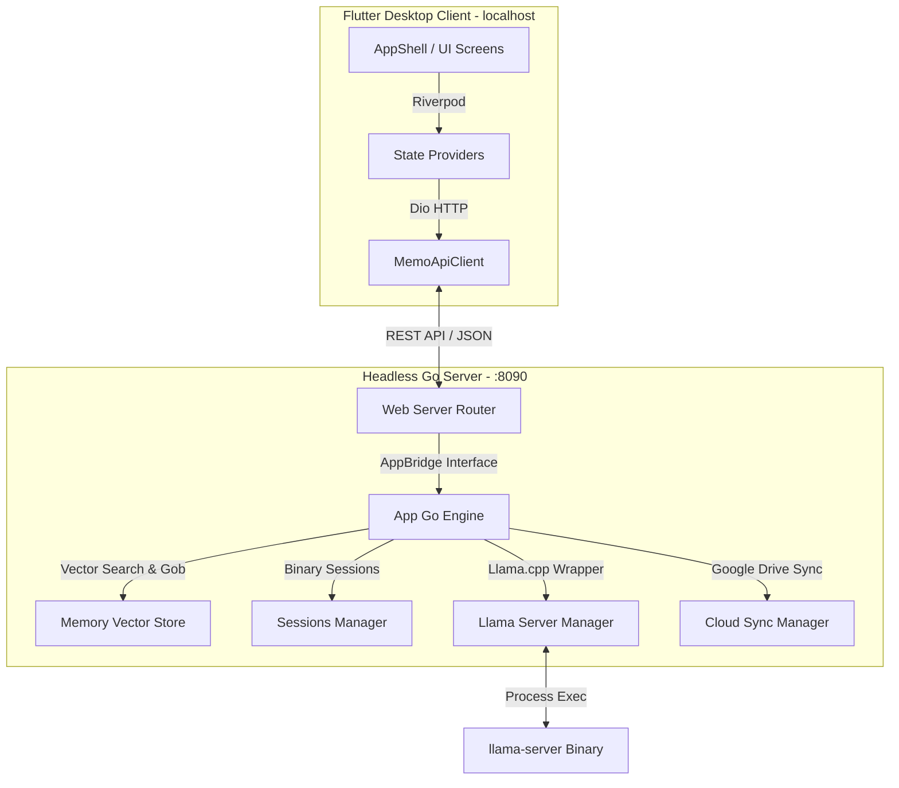

# Memo — Detaylı Proje Mimari Analiz Raporu

Bu belge, **Memo (Local LLM Memory Shell)** projesinin teknik mimarisini, veri akışını, arka uç ve ön uç bileşenlerini, API tasarımlarını ve veri depolama katmanlarını detaylandırmak üzere hazırlanmıştır. Projenin çalışma prensiplerini ve kod tabanını anlamak için kalıcı bir başvuru kaynağıdır.

---

## 🏛️ 1. Genel Mimari ve Tasarım Felsefesi

Memo, sıradan bir yerel sohbet arayüzü değildir. Temel odağı, kullanıcının yerel yapay zeka modelleriyle yaptığı etkileşimleri **gizlilik odaklı ve yüksek performanslı bir "İkinci Beyin" (Second Brain)** yapısına dönüştürmektir.

### Temel Sütunlar:
1.  **Sovereign Interface (Egemen Arayüz):** Kullanıcının tüm verileri kendi donanımında kalır. Sıfır veri sızıntısı ve çevrimdışı (offline) çalışabilme esastır.
2.  **Contextual Resonance (Bağlamsal Rezonans):** RAG (Retrieval-Augmented Generation) mekanizması sayesinde asistan, kullanıcının geçmiş konuşmalarını hatırlar, düşünme biçimini öğrenir ve her etkileşimde kişiselleştirilmiş yanıtlar üretir.
3.  **Decoupled & Headless (Gevşek Bağlı & Arayüzsüz):** Sistem, Wails-Svelte monolitik yapısından tamamen ayrıştırılmış; Go ile yazılmış headless bir REST API sunucusu ve Flutter ile yazılmış native bir masaüstü arayüzünden oluşmaktadır.

---

## 📐 2. Sistem Bileşenleri ve İletişim Şeması

Aşağıdaki şemada, Flutter Masaüstü uygulaması ile Headless Go Backend arasındaki veri akışı ve bileşen etkileşimleri gösterilmektedir:



### A. İletişim Protokolü:
*   **Protokol:** HTTP/REST (Plain HTTP, TLS yok). Localhost üzerinde self-signed sertifika hatalarını önlemek için düz HTTP tercih edilmiştir.
*   **Varsayılan Port:** `8090` (Backend parametrik olarak `--port` bayrağı ile değiştirilebilir).
*   **Veri Formatı:** JSON (MIME-Type: `application/json`). Çoklu ortam dosyaları `Multipart/Form-Data` olarak taşınır.

---

## 💾 3. Bilişsel Motor ve Veri Katmanı (Cognitive Engine)

### A. RAG (Retrieval-Augmented Generation) Mekanizması:
Sohbet esnasında veri akışı şu şekilde işler:
1.  Kullanıcı bir mesaj gönderir.
2.  **Bellek Sorgulama (Retrieval):** Gönderilen mesaj, yerel embedding sunucusu (varsayılan port: `8082`) aracılığıyla vektörleştirilir.
3.  **Vektör Arama:** [internal/memory](file:///home/bugrapc/Documents/local-llmmmemory/internal/memory) modülü, kullanıcının yerel hafıza dizinindeki vektör dosyalarında kosinüs benzerliği (cosine similarity) araması yaparak en yakın "anıları" (memories) çeker.
4.  **Bağlam İnşası (Context Construction):** Elde edilen anılar, [internal/identity](file:///home/bugrapc/Documents/local-llmmmemory/internal/identity) tarafından yönetilen sistem komutuna (System Prompt) gizlice eklenir.
5.  **LLM Sorgusu:** Birleştirilmiş prompt (Sistem komutu + anılar + oturum geçmişi + aktif mesaj) yerel LLM sunucusuna iletilir.
6.  **Kalıcılık (Persistence):** LLM'den gelen cevap kullanıcıya gösterilirken, asenkron olarak arka planda yeni etkileşim semantik indeksleme yapılarak yerel hafızaya kaydedilir.

### B. Depolama Formatı ve Kalıcılık (.gob):
*   **Binary-Atomic Persistence:** Memo, yüksek hızlı okuma/yazma ve veri tutarlılığı için Go'nun yerel `.gob` ikili formatını kullanır.
*   **Atomik Yazma:** Her bir etkileşim veya anı, bağımsız birer ikili dosya olarak kaydedilir. Bu sayede olası bir çökme veri tabanının tamamını bozmaz (SQL tabanlı veritabanı çökmelerinin önüne geçilir).
*   **Lazy Loading:** Anılar belleğe (RAM) yalnızca ihtiyaç duyulduğunda (semantik arama tetiklendiğinde) yüklenir. Bu sayede yıllarca süren sohbet geçmişinde bile bellek tüketimi sıfıra yakın kalır.

---

## 📡 4. Backend Modülleri Detaylı Analizi (Go)

Backend kodu [internal/](file:///home/bugrapc/Documents/local-llmmmemory/internal/) dizini altında modüler bir şekilde organize edilmiştir:

1.  **`internal/webserver` ([server.go](file:///home/bugrapc/Documents/local-llmmmemory/internal/webserver/server.go)):**
    *   İki farklı modda sunucu başlatabilir: `StartHTTP` (Flutter masaüstü ile haberleşen localhost HTTP sunucusu) ve `Start` (Dış erişim için HTTPS/TLS destekli uzaktan erişim sunucusu).
    *   **AppBridge/FullBridge:** Web sunucusu ile ana uygulama mantığı (`app.go`) arasındaki gevşek bağı sağlar.
2.  **`internal/llama`:**
    *   Yerel `llama-server` süreçlerini yönetir.
    *   Sohbet sunucusu ve embedding sunucusu olmak üzere iki ayrı süreci izole bir şekilde başlatıp durdurabilir.
    *   `llama.cpp` kurulumunu (`llamaInstaller`) işletim sistemine uygun şekilde otomatikleştirir.
3.  **`internal/memory`:**
    *   Semantik hafıza yönetimini, vektör veritabanını, kosinüs benzerliği hesaplamalarını ve `.gob` serializasyonunu yönetir.
4.  **`internal/sessions`:**
    *   Sohbet oturumlarını yönetir (`data/sessions` dizininde JSON formatında saklanır). Sohbetlerin silinmesi, adlandırılması ve aktif oturum geçmişinin döndürülmesinden sorumludur.
5.  **`internal/cloudsync`:**
    *   Google Drive entegrasyonu sağlar.
    *   Verileri buluta yüklemeden önce kullanıcının belirlediği özel **Passphrase (Parola)** ile AES-256 tabanlı uçtan uca şifreler.
6.  **`internal/config`:**
    *   `config/config.yaml` dosyasını okuyarak sistem yapılandırmasını (Portlar, API ayarları, Llama ayarları vb.) yükler.

---

## 📱 5. Frontend Modülleri Detaylı Analizi (Flutter)

Flutter tarafı, modern Material 3 standartlarında, yüksek performanslı ve reaktif bir yapı sunar:

1.  **Giriş ve AppShell ([app_shell.dart](file:///home/bugrapc/Documents/local-llmmmemory/frontend/lib/screens/app_shell.dart)):**
    *   Sol taraftaki minimalist navigasyon rayı (NavRail) üzerinden Sohbet (`ChatScreen`) ve Model Deposu (`ModelStoreScreen`) sekmeleri arasında geçiş sağlar.
    *   İlk açılışta `SetupWizardOverlay` (Kurulum Sihirbazı) ve `LlamaInstallerOverlay` (Llama sunucusu yükleyici) katmanlarını yönetir.
2.  **Durum Yönetimi (Riverpod Providers):**
    *   `chatProvider`: Aktif mesajları, mesaj gönderim durumunu ve stream akışlarını yönetir.
    *   `localModelsProvider`: İndirilmiş yerel modellerin listesini ve silme/yükleme durumlarını takip eder.
    *   `settingsProvider`: Sistem dili, karanlık mod, sistem promptu gibi ayarları yönetir.
3.  **Aesthetic Design (Greige Theme - [theme.dart](file:///home/bugrapc/Documents/local-llmmmemory/frontend/lib/core/theme.dart)):**
    *   Gözü yormayan pastel bej-gri tonları, yumuşatılmış köşeler (`radiusMd`, `radiusLg`) ve kaliteli tipografi ile premium bir arayüz sunar.
4.  **Modüler Dialoglar ve Widget'lar:**
    *   `SettingsDialog`: Genel, Sistem Komutu, Gizli Mod Komutu, Hafıza Temizleme, Senkronizasyon, Uzaktan Erişim ayarlarını içeren sekmeli yapı.
    *   `ModelConfigDialog`: Modeli başlatırken GPU katman sayısı (VRAM), bağlam boyutu ve port seçimi yapılmasına olanak tanır.
    *   `ChatInput`: Zengin metin girişi, resim ekleme (Multimodal LLM'ler için), dosya içeriği okuma (RAG'e besleme) ve ses kaydı butonlarını barındırır.

---

## 🔌 6. REST API Endpoint Tablosu

Aşağıda ön uç ile arka uç arasındaki REST haberleşmesinin tam listesi bulunmaktadır:

| Endpoint | Metot | Açıklama |
| :--- | :--- | :--- |
| `/api/send` | POST | Klasik mesaj gönderimi (JSON gövdesi ile) |
| `/api/send/stream` | POST | Akışlı mesaj gönderimi (SSE fallback ile) |
| `/api/send_file` | POST | Dosya/Görsel içeren mesaj gönderimi (Multipart) |
| `/api/chats` | GET | Kayıtlı tüm sohbet oturumlarını listeler |
| `/api/chats/new` | POST | Yeni bir sohbet oturumu oluşturur |
| `/api/chats/switch` | POST | Belirtilen sohbet oturumuna geçiş yapar |
| `/api/chats/delete` | POST | Belirtilen sohbet oturumunu siler |
| `/api/messages` | GET | Aktif sohbet oturumunun mesaj geçmişini getirir |
| `/api/status` | GET | Sistem durumunu ve hafıza anı sayısını döndürür |
| `/api/incognito` | POST | Gizli modu açar/kapatır (Gizli modda anılar kaydedilmez) |
| `/api/system-prompt` | GET/PUT | Sistem komutunu çeker veya günceller |
| `/api/memory/files` | GET/DEL | Semantik anı dosyalarını listeler veya tek tek siler |
| `/api/memory/clear` | POST | Tüm semantik hafızayı tamamen sıfırlar |
| `/api/models/local` | GET/DEL | İndirilmiş/İçe aktarılmış modelleri listeler veya siler |
| `/api/models/start` | POST | Belirtilen modeli llama-server üzerinde başlatır |
| `/api/models/stop` | POST | Çalışan yerel modeli durdurur |
| `/api/models/status` | GET | Yerel modelin aktiflik/çalışma durumunu döndürür |
| `/api/gpu` | GET | Sistemdeki aktif GPU'yu ve VRAM miktarını tespit eder |
| `/api/models/search` | POST | HuggingFace üzerinde GGUF modeli arar |
| `/api/models/download` | POST | HuggingFace üzerinden model indirme işlemi başlatır |
| `/api/models/download/progress` | GET | Aktif indirme işleminin yüzdesini ve hızını döndürür |
| `/api/models/llama/check` | GET | `llama.cpp` yerel sunucusunun kurulu olup olmadığını kontrol eder |
| `/api/sync/settings` | GET/PUT | Cloud Sync (Bulut Yedekleme) ayarlarını yönetir |

---

## 🛠️ 7. Geliştirme (Development) ve Derleme Kılavuzu

### Geliştirici Ortamı Kurulumu:
Sistemi geliştirme aşamasında ayağa kaldırmak için iki ayrı terminal sekmeli çalıştırılmalıdır:

```bash
# 1. Terminal: Backend'i başlatın
go run . --port 8090

# 2. Terminal: Frontend'i başlatın
cd frontend
flutter run -d linux
```

### Derleme ve Paketleme (Linux):
Projenin kök dizininde bulunan [package_linux.sh](file:///home/bugrapc/Documents/local-llmmmemory/package_linux.sh) betiği çalıştırıldığında sistem otomatik olarak:
1.  Go backend kodunu bağımsız bir çalıştırılabilir binary olarak derler.
2.  Flutter ön yüzünü Linux için `release` modunda derler.
3.  Tüm konfigürasyon, veri klasörleri ve `.env` şablonlarını `build_output/memo-linux-x64/` klasörüne kopyalar.
4.  Çift tıklamayla veya terminalden `./run_memo.sh` ile çalıştırıldığında arka planda eski açık portları temizleyen, backend'i sessizce ayağa kaldıran ve Flutter arayüzünü açan akıllı başlatıcı betiğini hazırlar.
