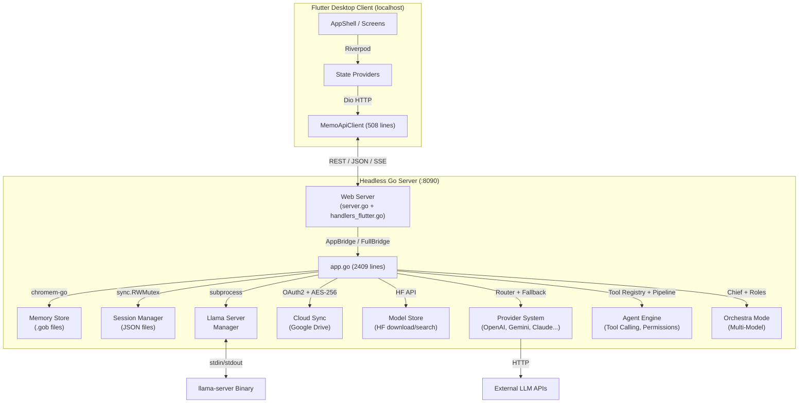
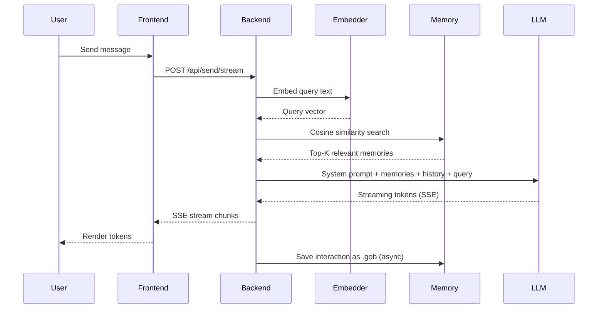
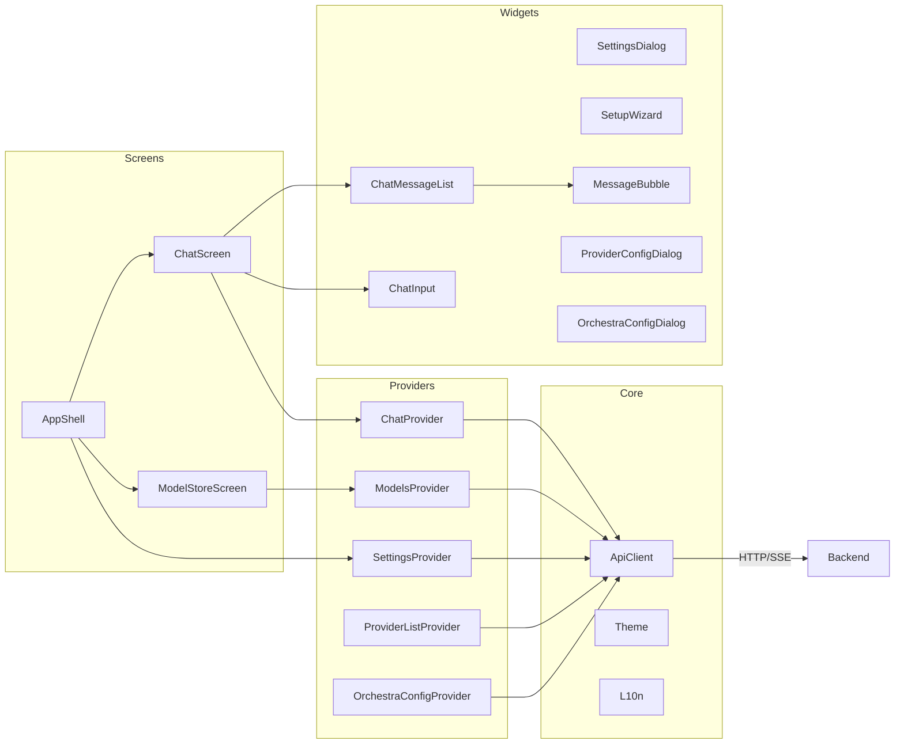

# Memo — Architecture & Technical Deep Dive

This document details the technical architecture, data flow, backend and frontend components, API design, and storage layers of **Memo (Local LLM Memory Shell)**.

---

## 🏛️ 1. High-Level Architecture



### Communication Protocol
- **Protocol:** HTTP/REST (plain HTTP, no TLS on localhost)
- **Default Port:** `8090` (configurable via `--port`)
- **Data Format:** JSON (`application/json`), Multipart for file uploads
- **Streaming:** Server-Sent Events (SSE) for LLM token streaming

---

## 💾 2. Storage Layer

### Memory Store (`internal/memory/`)
- **Format:** Go binary `.gob` files, one file per interaction
- **Vector DB:** In-memory `chromem-go` index built from `.gob` files on startup
- **Search:** Brute-force cosine similarity (O(N) over all embeddings)
- **Embedding:** Local embedding model via OpenAI-compatible API (default port 8082)
- **Limitations:**
  - Startup time increases linearly with memory count (`LoadCache`)
  - No incremental indexing — full rebuild on every restart
  - `hash2hex` uses only 4 bytes of SHA-256 → collision risk

### Session Manager (`internal/sessions/`)
- **Format:** JSON files in `data/sessions/`
- **Persistence:** Written on every message (synchronous)
- **Session ID:** UUID truncated to first 8 hex chars → collision risk
- **Auto-title:** Generated from first user message content

### Config (`config/config.yaml`)
- YAML-based, loaded at startup
- Contains: llama settings, API keys, sync config, GPU config
- **Note:** Written with `0644` permissions (world-readable)

---

## 🧠 3. Cognitive Engine (RAG Pipeline)



### RAG Flow:

1. **User sends message** → Flutter → `POST /api/send/stream`
2. **Embedding:** Query is vectorized via local embedding model
3. **Retrieval:** Cosine similarity search over all `.gob` memory entries
4. **Context construction:** Relevant memories injected into system prompt
5. **LLM routing (priority order):**
   - **Orchestra mode** (if enabled) → multi-model workflow (chief → experts → synthesis)
   - **External provider** (if `activeProvider` set) → `provider.Router` with fallback chain
   - **Local llama.cpp** → `api.Client` pointed at local `llama-server`
6. **Streaming:** Tokens delivered via SSE, rendered in real-time
7. **Persistence:** Interaction saved asynchronously to `.gob`

> **Agent mode** overrides normal flow when enabled + active provider set: `SendMessageStream` routes to `callAgentStream` which runs the LLM tool-calling pipeline.

---

## 🖥️ 4. Backend Modules

### `app.go` (2409 lines)
Central orchestrator. Manages:
- LLM client lifecycle (`a.client`, `a.embeddingClient`)
- Model start/stop/swap
- Memory store init & reinit
- Session management
- Cloud sync manager
- Incognito mode toggle
- Provider config manager + router (external LLM APIs)
- Agent executor (tool calling, permissions, pipeline)
- Orchestra conductor (multi-model orchestration)

**Known issues:**
- `a.syncManager` assigned without lock → data race
- `a.store` assigned without `storeMu` at startup
- Background errors reach UI via event ring buffer (64 events) but overflow drops oldest

### `internal/webserver/server.go` (583 lines)
- Dual-mode server: `StartHTTP` (localhost) and `Start` (remote/TLS)
- Router with ~40+ handler registrations
- SSE streaming endpoint handler
- **Known issue:** `Shutdown(context.Background())` can block indefinitely

### `internal/webserver/handlers_flutter.go` (960 lines)
All Flutter-facing REST handlers:
- Chat CRUD, message send/stream
- Model management (list, start, stop, download)
- Memory management (list, delete, clear)
- GPU detection, sync settings, config updates
- Provider CRUD + test connection + active provider
- Agent mode toggle, permission response, permission CRUD
- Orchestra config (get/put)

**Known issues:** SSE handler doesn't monitor `request.Context().Done()` → orphaned streams (mitigated via context propagation)

### `internal/llama/llama.go` (462 lines)
- `llama-server` subprocess lifecycle (start, stop, monitor, wait-ready)
- GPU layer detection & configuration
- Port conflict resolution (`killByPort`)
- **Known issue:** `monitor()` goroutine accesses `s.cmd` outside lock

### `internal/llama/installer.go` (646 lines)
- Automatic `llama.cpp` binary download from GitHub releases
- Git clone + build from source fallback
- tar.gz / zip extraction for all platforms
- **Known issue:** File descriptor leak in `extractTarGzToBin`

### `internal/llama/gpu.go` (232 lines)
- GPU detection for NVIDIA (nvidia-smi), AMD (rocm-smi), Apple Metal
- VRAM calculation and layer count recommendation
- **Known issue:** `nvidia-smi` errors silently ignored → 0 VRAM → CPU fallback

### `internal/memory/store.go` + `retriever.go` + `embedder.go`
- `.gob` file-based vector storage
- O(N) brute-force search with concurrent workers
- Embedding via OpenAI-compatible API
- **Known issue:** `LoadCache` O(N) startup, no incremental index

### `internal/modelstore/modelstore.go` (458 lines)
- HuggingFace model search & download
- Local model file management (import, delete, list)
- Download progress tracking with cancel support
- **Known issue:** Temp file leak on non-cancellation download errors

### `internal/cloudsync/sync_manager.go` + `drive.go` + `crypto.go`
- Google Drive OAuth2 authentication (loopback server)
- AES-256-GCM encryption with passphrase-derived key
- Periodic/triggered pull/push/full-sync pipeline
- Zip-based archive format for cloud storage
- **Known issues:** Weak KDF (single SHA-256), hardcoded fallback key, no timeout on OAuth exchange

### `internal/sessions/sessions.go` (262 lines)
- Chat session CRUD with JSON persistence
- Auto-title generation from first message
- **Known issues:** UUID truncation to 8 hex chars, save errors silently discarded

### `internal/identity/identity.go` + `styles.go`
- User identity management (name, personality)
- System prompt construction with memory injection

### `internal/provider/` (10 files, ~1700 lines total)
External LLM provider system:
- **`provider.go`** — `Provider` interface (`ChatCompletion`, `ChatCompletionStream`, `ListModels`) + factory
- **`config.go`** — `ConfigManager`: AES-256-GCM encrypted API keys in `data/providers.json`, machine-derived key
- **`router.go`** — Multi-provider router with fallback chain, auto-disable after 3 failures, health check goroutine
- **`openai.go`** — Full OpenAI-compatible implementation (ChatCompletion, SSE parsing, ListModels)
- **`gemini.go`** — Custom Google Gemini implementation (`generateContent`, `streamGenerateContent`)
- **`claude.go`** — Custom Anthropic Claude implementation (`x-api-key` auth, SSE event parsing)
- **`grok.go`/`groq.go`/`openrouter.go`/`ollama.go`** — Thin OpenAI-compatible wrappers (different base URLs)
- **Known issues:** Provider `Priority` field exists but unused by router; no test files

### `internal/agent/` (8 files, ~1450 lines total)
Agent execution engine:
- **`tools.go`** — Tool definition system: `ToolDef`, `DangerLevel` (Safe/Medium/Dangerous), `ToolRegistry` with 8 built-in tools
- **`permissions.go`** — `PermissionManager`: 6 policies (PromptAlways, AllowOnce/Session/Forever, DenyOnce/Forever), SHA-256 arg hashing, persistent JSON storage
- **`sandbox.go`** — `Sandbox` with path traversal protection, rate limiting (30 calls/min, 5s cooldown), command blacklist (23 patterns)
- **`pipeline.go`** — `Pipeline`: LLM → tool call → permission check → execution → result loop (max 20 iterations), event streaming via channels
- **`executor.go`** — Top-level orchestrator: `RunStream()`, `HandlePermissionResponse()`, audit log (last 1000 entries)
- **`tools/file.go`/`command.go`/`search.go`** — Tool implementations with path validation, backup creation, environment variable masking
- **Known issues:** No test files; frontend agent UI not implemented yet

### `internal/orchestra/` (3 files, ~1000 lines total)
Multi-model orchestration (Orchestra Mode):
- **`conductor.go`** — `Conductor`: plan (chief analyzes + decomposes), execute (parallel/sequential tasks), synthesize (chief merges results)
- **`types.go`** — `OrchestraConfig`, `OrchestraTask`, `OrchestraPlan`, `OrchestraResult`, `ProgressUpdate` with streaming
- **`roles.go`** — 8 built-in roles (planner, frontend, backend, bug_fixer, reviewer, security, devops, general) with Turkish system prompts
- Retry: `callWithRetry` (rate limit + exponential backoff + jitter), `retryTask` (2 retries, 3s base delay)
- Parallel execution via goroutines + WaitGroup; sequential via dependency resolution (DAG)
- **Known issues:** Orchestra bypasses `provider.Router` (creates providers directly); chief model must support JSON output

### `internal/api/types.go` + `client.go` + `streaming.go`
- OpenAI-compatible API client types
- HTTP client for llama-server communication
- SSE parsing with thinking/reasoning extraction
- **Known issue:** `[DONE]` chunk missing `finish_reason`

---

## 📱 5. Frontend (Flutter)

### Architecture
- **State Management:** Riverpod 2.x (Notifier + AsyncNotifier)
- **HTTP Client:** Dio with SSE interceptor
- **Platform:** Flutter 3.10+ (Linux, Windows, macOS)

### Module Map



### Key Components

| Component | File | Lines | Responsibility |
|---|---|---|---|---|
| `ApiClient` | `api_client.dart` | ~600 | All REST + SSE communication |
| `ChatProvider` | `chat_provider.dart` | 192 | Message state, stream handling |
| `ModelsProvider` | `models_provider.dart` | 106 | Model list, download progress |
| `SettingsProvider` | `settings_provider.dart` | 270 | App settings, llama config |
| `ProviderListNotifier` | `provider_provider.dart` | 88 | Provider config CRUD |
| `OrchestraConfigNotifier` | `orchestra_provider.dart` | 31 | Orchestra config state |
| `ChatMessageList` | `chat_message_list.dart` | 450 | Message rendering, markdown |
| `ChatInput` | `chat_input.dart` | 283 | Text input, file attach, STT, `/orchestra` command |
| `SettingsDialog` | `settings_dialog.dart` | 2129 | 8-tab settings (incl. API Providers + Orchestra) |
| `ProviderConfigDialog` | `provider_config_dialog.dart` | 264 | Add/edit external provider config |
| `OrchestraConfigDialog` | `orchestra_config_dialog.dart` | 330 | Configure chief model + role assignments |
| `ModelStoreScreen` | `model_store_screen.dart` | 1223 | HF model search + download |
| `SetupWizardView` | `setup_wizard_view.dart` | 296 | First-run setup flow |

### Known Issues
- `AnimationController` per message bubble → severe jank with 50+ messages (fixed in v3.0.0)
- Auto-scroll yanks to bottom when reading history (fixed in v3.0.0)
- Download polling loop never cancels (fixed in v3.0.0)
- Cloud Sync UI completed; Remote Access tab shows "disabled in v3.0.0"
- Agent frontend UI (permission dialog, tool call cards, mode toggle) not yet implemented
- No agent-related API methods in `api_client.dart`

---

## 🔌 6. REST API Endpoints

| Method | Endpoint | Description |
|---|---|---|
| `POST` | `/api/send` | Classic message (JSON body) |
| `POST` | `/api/send/stream` | Streaming message (SSE) |
| `POST` | `/api/send_file` | File/image message (Multipart) |
| `GET` | `/api/chats` | List all chat sessions |
| `POST` | `/api/chats/new` | Create new chat |
| `POST` | `/api/chats/switch` | Switch active session |
| `POST` | `/api/chats/delete` | Delete session |
| `GET` | `/api/messages` | Get active chat history |
| `GET` | `/api/status` | System status + memory count |
| `POST` | `/api/incognito` | Toggle incognito mode |
| `GET`/`PUT` | `/api/system-prompt` | Get/update system prompt |
| `GET`/`DEL` | `/api/memory/files` | List/delete memory files |
| `POST` | `/api/memory/clear` | Clear all memory |
| `GET`/`DEL` | `/api/models/local` | List/delete local models |
| `POST` | `/api/models/start` | Start a model |
| `POST` | `/api/models/stop` | Stop running model |
| `GET` | `/api/models/status` | Model runtime status |
| `GET` | `/api/gpu` | GPU detection info |
| `POST` | `/api/models/search` | Search HuggingFace for GGUF |
| `POST` | `/api/models/download` | Start model download |
| `GET` | `/api/models/download/progress` | Download progress |
| `GET` | `/api/models/llama/check` | Check llama.cpp installed |
| `GET`/`PUT` | `/api/sync/settings` | Cloud sync settings |
| `GET`/`PUT` | `/api/config/llama` | Llama configuration |
| `POST` | `/api/image` | Read image (⚠️ arbitrary file read) |
| `POST` | `/api/embed/start/stop` | Embedding server control |
| `GET`/`PUT`/`DELETE` | `/api/providers` | List/update/delete provider configs |
| `POST` | `/api/providers/test` | Test provider connection |
| `GET`/`PUT` | `/api/providers/active` | Get/set active provider |
| `GET`/`PUT` | `/api/agent/enabled` | Get/set agent mode |
| `POST` | `/api/agent/permission` | Respond to permission request |
| `GET` | `/api/agent/permissions` | List permanent permissions |
| `DELETE` | `/api/agent/permissions` | Revoke or clear permissions |
| `GET`/`PUT` | `/api/orchestra/config` | Get/update orchestra config |

---

## 🛠️ 7. Development & Build

### Prerequisites
- Go 1.25+
- Flutter 3.10+
- llama.cpp (auto-installed by the app, or manual)

### Development (two terminals)
```bash
# Terminal 1: Backend
go run . --port 8090

# Terminal 2: Frontend
cd frontend && flutter run -d linux
```

### Build for Linux
```bash
./package_linux.sh
# Output: build_output/memo-linux-x64/
```

---

## 📋 8. Current Status & Roadmap

| Version | Status | Focus |
|---|---|---|
| **v3.0.0-beta** | Current | External providers + Agent engine + Orchestra (backend complete, frontend agent UI pending) |
| **v3.0.0** | Planned | Agent frontend UI, multi-step planning, file edit, git, web scraping |
| **v4.0.0** | Future | SQLite migration, UI overhaul, missing frontend tabs |
| **v5.0.0** | Future | Plugins, mobile, knowledge graph, autonomy |

**Full known issues:** [docs/KNOWN_ISSUES.md](./docs/KNOWN_ISSUES.md)
**Detailed roadmap:** [docs/ROADMAP.md](./docs/ROADMAP.md)

---

> **Last updated:** 2026-06-05
> **Codebase audit:** 42 known issues (10 critical, 10 high, 12 medium, 10 low) + 10 observations
