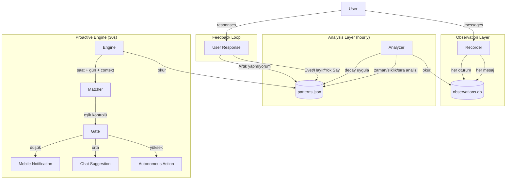

# Memo Learning System — Proactive Intelligence Engine

> **Status:** Design Document — Pre-Implementation  
> **Version:** v1.0  
> **Target Release:** v3.5.0+

---

## 1. Philosophy

Memo should not be a passive chatbot that waits for commands. It should **observe, learn, anticipate, and act** — like a real personal assistant who knows your habits, notices when they change, and adapts without being told.

### Core Principles

| Prensip | Açıklama |
|---------|----------|
| **Local-first** | Tüm öğrenme ve karar verme cihazda olur. Hiçbir veri dışarı çıkmaz |
| **Olasılıksal** | Pattern'ler binary değil, olasılık dağılımıdır. Zamanla değişir, adapte olur |
| **Unutabilen** | Eski pattern'ler decay ile ölür. Kullanıcı değişince sistem de değişir |
| **Kademeli** | Düşük güvende sor, orta güvende öner, yüksek güvende yap |
| **Şeffaf** | Kullanıcı tüm pattern'leri görebilir, düzeltebilir, silebilir |
| **Varsayılan kapalı** | Proactive Learning ayardan açılır. İzin yoksa sadece gözlem yapar, hiçbir şey söylemez |

---

## 2. Architecture

### High-Level Data Flow



### Module Map

| Module | File | Responsibility |
|--------|------|---------------|
| `internal/observer/store.go` | SQLite CRUD for observations | Kaydet, sorgula, istatistik |
| `internal/observer/recorder.go` | app.go integration hook | Her mesajda/session'da kayıt |
| `internal/observer/analyzer.go` | Pattern detection engine | Zaman/sıklık/sıra analizi, confidence |
| `internal/observer/decay.go` | Sliding window + exponential decay | Eski pattern'leri zayıflat, sil |
| `internal/proactive/engine.go` | Main loop goroutine | Her 30sn'de bir pattern'leri kontrol et |
| `internal/proactive/matcher.go` | Current time ↔ pattern match | Şu an hangi pattern'ler eşleşiyor? |
| `internal/proactive/gate.go` | Confidence threshold logic | Hangi eşikte ne yapılır |
| `internal/proactive/notifier.go` | Notification + suggestion dispatch | Mobile push, chat mesajı, oto-pilot |

---

## 3. Observation Layer

### What Gets Recorded

Every user interaction generates an observation:

```go
type Observation struct {
    ID                int64     `json:"id"`
    Timestamp         time.Time `json:"timestamp"`
    DayOfWeek         int       `json:"day_of_week"`         // 0=Sunday
  
    TimeOfDaySeconds  int       `json:"time_of_day_seconds"` // saniye cinsinden (0-86399)
    SessionLengthMin  int       `json:"session_length_min"`
    Topic             string    `json:"topic"`               // "coding", "general", "planning"
    ActivityType      string    `json:"activity_type"`       // "chat", "agent", "orchestra"
    WordCount         int       `json:"word_count"`
    Metadata          string    `json:"metadata"`            // JSON blob for extensibility
}
```

### Recording Triggers

| Trigger | Timing | Data |
|---------|--------|------|
| Message sent | User mesaj gönderdiğinde | timestamp, time_of_day, topic |
| Session start | Sohbet açıldığında | timestamp, day_of_week |
| Session end | Sohbet kapatıldığında | session_length |
| Agent mode run | Agent tool çağırdığında | activity_type="agent" |
| Orchestra run | Orchestra çalıştığında | activity_type="orchestra" |

### Topic Extraction

Konu etiketi external API olmadan çıkarılır:

```go
func extractTopic(text string) string {
    // 1. Keyword matching (regex tabanlı, local)
    // 2. RAG memory'den en yakın konu başlığı
    // 3. Fallback: "general"
    //
    // Keywords:
    //   "kod", "yaz", "hata", "debug", "test" → "coding"
    //   "eve", "gel", "akşam", "yemek"        → "home_arrival"
    //   "toplantı", "iş", "proje"              → "work"
    //   "oku", "ara", "öğren"                  → "research"
    //   "spor", "koş", "yürü"                  → "sport"
}
```

---

## 4. Pattern Detection Algorithm

### 4.1 Time-Based Pattern Detection (Core)

Her aktivite tipi için saat bazlı bir **olasılık yoğunluk fonksiyonu** oluşturulur.

**Veri yapısı:**

```go
type TimePattern struct {
    ActivityType     string    `json:"activity_type"`
    TimePeakSeconds  int       `json:"time_peak_seconds"`    // dağılımın tepe noktası (saniye)
    StdDevSeconds    int       `json:"std_dev_seconds"`      // standart sapma — ne kadar dağınık
    Confidence       float64   `json:"confidence"`            // 0.0 - 1.0
    DaysActive       [7]bool   `json:"days_active"`           // hangi günler aktif
    TotalCount       int       `json:"total_count"`
    FirstSeen        time.Time `json:"first_seen"`
    LastSeen         time.Time `json:"last_seen"`
    WeightedScore    float64   `json:"weighted_score"`        // decay uygulanmış skor
}
```

**Confidence hesaplama:**

```go
func calculateConfidence(observations []Observation, now time.Time) float64 {
    // 1. Sliding window: sadece son 30 gün
    window := now.Add(-30 * 24 * time.Hour)
    var recent []Observation
    for _, o := range observations {
        if o.Timestamp.After(window) {
            recent = append(recent, o)
        }
    }
    if len(recent) < 3 {
        return 0.0 // yeterli veri yok
    }

    // 2. Consistency: zamanlar ne kadar tutarlı?
    mean, stdDev := meanAndStdDev(recent)
    consistency := 1.0 / (1.0 + float64(stdDev)/1800.0) // 30 dk = 0.5

    // 3. Frequency: beklenen sıklıkta mı?
    expectedCount := float64(len(recent)) / 30.0 // günlük ortalama
    frequency := math.Min(expectedCount, 1.0)

    // 4. Recency: ne kadar yeni?
    daysSinceLast := now.Sub(recent[len(recent)-1].Timestamp).Hours() / 24.0
    recency := 1.0 / (1.0 + daysSinceLast)

    // 5. Weighted birleşim
    confidence := 0.5*consistency + 0.3*frequency + 0.2*recency
    return math.Min(confidence, 1.0)
}
```

**Standart sapma hesaplama (modüler):**

Her observation'ın time_of_day_seconds'ı 24 saatlik çemberde bir noktadır. Ortalama ve sapma dairesel istatistik (circular statistics) ile hesaplanır, böylece gece yarısı sorunu (23:59 ile 00:01 arası) oluşmaz.

### 4.2 Sequential Pattern Detection

A aktivitesinden sonra B geliyor mu? Sıralı pattern'ler:

```go
type SequentialPattern struct {
    TriggerActivity string  `json:"trigger_activity"`
    FollowActivity  string  `json:"follow_activity"`
    MaxGapMinutes   int     `json:"max_gap_minutes"`
    Confidence      float64 `json:"confidence"`
    Count           int     `json:"count"`
}
```

Örnek: "Kod yazdıktan sonra test çalıştır → 5dk içinde" (confidence 0.78)

### 4.3 Day-of-Week Masking

Her pattern hangi günler aktif olduğunu tutar:

```
[Pzt, Sal, Çar, Per, Cum, Cmt, Paz]
[1,   1,   1,   1,   1,   0,   0 ]  → Hafta içi pattern'i
[0,   0,   1,   0,   0,   0,   0 ]  → Sadece Çarşamba
```

Böylece hafta sonu ve hafta içi farkı otomatik ayrışır.

---

## 5. Decay & Forgetting

### Sliding Window

Sadece son 30 günün verisi analiz edilir. 31 gün önceki gözlemler yok sayılır.

```
Bugün:      gözlem var → ağırlık 1.0
7 gün önce: gözlem var → ağırlık 0.7
15 gün önce: gözlem var → ağırlık 0.4
25 gün önce: gözlem var → ağırlık 0.15
30+ gün önce: gözlem yok sayılır
```

### Exponential Decay

Pattern confidence, son gözlemden bu yana geçen süreyle azalır:

```go
func applyDecay(confidence float64, lastSeen time.Time, now time.Time) float64 {
    daysSince := now.Sub(lastSeen).Hours() / 24.0
    decayFactor := math.Pow(0.95, daysSince) // her gün %5 azalma
    return confidence * decayFactor
}
```

30 gün sonra: `0.95^30 ≈ 0.21` — pattern neredeyse silinir.

### Explicit Forget

Kullanıcı "Artık yapmıyorum" dediğinde:

```go
func (a *App) handleExplicitForget(activityType string) {
    a.proactiveEngine.ForgetPattern(activityType)
    // Pattern silinir, ilgili tüm observation'lar arşivlenir
}
```

---

## 6. Proactive Engine

### Main Loop

```go
func (e *Engine) Start(ctx context.Context) {
    ticker := time.NewTicker(30 * time.Second)
    for {
        select {
        case <-ctx.Done():
            return
        case <-ticker.C:
            e.tick()
        }
    }
}

func (e *Engine) tick() {
    now := time.Now()
    patterns := e.loadActivePatterns()
    
    for _, p := range patterns {
        matchScore := e.matcher.Match(p, now)
        if matchScore <= 0 {
            continue
        }
        action := e.gate.Decide(p, matchScore)
        e.execute(action, p)
    }
}
```

### Matching Logic

```go
func (m *Matcher) Match(pattern TimePattern, now time.Time) float64 {
    // 1. Gün kontrolü
    if !pattern.DaysActive[now.Weekday()] {
        return 0.0
    }
    
    // 2. Zaman kontrolü (olasılıksal)
    currentSec := now.Hour()*3600 + now.Minute()*60
    diff := circularDistance(currentSec, pattern.TimePeakSeconds)
    
    // 3. Gaussian benzerlik
    score := gaussianPdf(diff, pattern.StdDevSeconds)
    
    // 4. Confidence ile çarp
    return score * pattern.Confidence * pattern.WeightedScore
}
```

### Decision Gate (3 Eşik)

```go
type ProactivityLevel string

const (
    LevelOff      ProactivityLevel = "off"       // sadece gözlem
    LevelSubtle   ProactivityLevel = "subtle"    // mobile notification
    LevelNormal   ProactivityLevel = "normal"    // chat suggestion
    LevelAssertive ProactivityLevel = "assertive" // oto-pilot
)

func (g *Gate) Decide(pattern TimePattern, matchScore float64) Action {
    level := g.config.Level
    
    if matchScore < 0.3 {
        return ActionNone // eşik altı
    }
    
    switch level {
    case LevelOff:
        return ActionNone
    case LevelSubtle:
        if matchScore >= 0.3 {
            return ActionNotify // sessiz bildirim
        }
    case LevelNormal:
        if matchScore >= 0.5 {
            return ActionSuggest // chat önerisi
        }
        if matchScore >= 0.3 {
            return ActionNotify
        }
    case LevelAssertive:
        if matchScore >= 0.85 && pattern.Confidence >= 0.9 && pattern.TotalCount >= 30 {
            return ActionAuto // oto-pilot
        }
        if matchScore >= 0.6 {
            return ActionSuggest
        }
        if matchScore >= 0.3 {
            return ActionNotify
        }
    }
    return ActionNone
}
```

---

## 7. Action Types

| Action | Ne Olur | Ne Zaman |
|--------|---------|----------|
| `ActionNone` | Hiçbir şey olmaz | Eşik altı, kapalı mod |
| `ActionNotify` | Mobile push bildirim: "Eve geliyor musun? Kahve hazırlasam?" | 0.3-0.5, subtle mod |
| `ActionSuggest` | Chat'te mesaj: "Saat 21 oldu, genelde kod yazıyorsun. Kaldığın yerden devam mı?" | 0.5-0.85, normal mod |
| `ActionAuto` | Agent pipeline tetiklenir. Kullanıcı gelince "Dün akşam testleri tamamladım, buradaydı." | 0.85+, assertive mod |

### Notification Content Rules

```
Düşük güven (0.3-0.5): Soru formatı
  "Eve geliyor musun? [Kahve hazırlasam/Eve gelince haber ver]"

Orta güven (0.5-0.85): Öneri formatı
  "Genelde bu saatte kod yazıyorsun. Kaldığın dosyayı açayım mı?"

Yüksek güven (0.85+): Statement formatı
  "Kod yazma vaktin. Dünkü testleri çalıştırdım, 3 hata düzelttim."
```

---

## 8. Feedback Loop

### Reinforcement Schedule

| Kullanıcı Tepkisi | Confidence Değişimi | Pattern Gücü |
|--------------------|--------------------|--------------|
| "Evet", "Başla", "Harika" | **+0.10** | Güçlenir |
| Yok sayar | **-0.03** | Hafif zayıflar |
| "Hayır", "Sonra" | **-0.15** | Zayıflar |
| "Artık yapmıyorum" | **Pattern silinir** | Sıfırlanır |
| "Sen ne diyorsun ya?" | **-0.30** | Ciddi zayıflar |

### Adaptive Threshold

Eğer kullanıcı sürekli benzer önerileri reddediyorsa, o pattern için eşik yükselir:

```
Kullanıcı "Hayır" dedi → pattern eşiği 0.50 → 0.55
Kullanıcı tekrar "Hayır" → 0.55 → 0.62
... 5 kere "Hayır" → eşik 0.85 → neredeyse hiç tetiklenmez
```

---

## 9. Multi-Pattern Resolution

Aynı anda birden fazla pattern eşleşebilir. Çözüm:

```
Saat: 19:00, Salı
  Pattern A: "Eve geliş"      → match 0.88, confidence 0.92
  Pattern B: "Spor"            → match 0.78, confidence 0.85 (Salı yüksek!)
  Pattern C: "Akşam yemeği"   → match 0.45, confidence 0.60

Karar:
  En yüksek action'ı al.
  A → ActionSuggest (0.88)
  B → ActionSuggest (0.78)
  
  Çakışma var (ikisi de 0.5 üstü).
  → Meme: "Eve geldin. Spor günün de bugün. Önce hangisi?"
  → Veya: "Eve geldin, kahve?"
  → Seçim: hangisi daha yüksek confidence? A kazanır.
```

---

## 10. Cold Start

Sistem ilk başladığında hiç veri yok. Bu durumda:

| Gün | Ne Olur |
|-----|---------|
| 1-3 | Sadece gözlem yapar. Hiçbir şey söylemez/önermez |
| 4-7 | Pattern oluşmaya başlar. Hiçbir şey söylemez (yeterli veri yok) |
| 8-14 | 3+ tekrar gözlemlendiyse **sormaya başlar** (subtle mod) |
| 15-30 | Güven artar, daha sık önerir |
| 30+ | Tam oto-pilot'a geçebilir |

**İlk günlerde zorlama:** Eğer kullanıcı ilk gün "Her sabah 9'da kod yazıyorum" gibi bir şey söylerse, Memo bunu RAG memory'den alıp bir pattern olarak önerebilir mi?

→ Hayır, çünkü bu öğrenme sistemi **eylem bazlı**, söylem bazlı değil. Ama kullanıcı Chat'te "Bana her sabah 9'da kod yazmayı hatırlat" derse, bu `identity.go`'daki system prompt'a veya bir `skill`'e dönüşebilir.

---

## 11. Privacy & Transparency

### User-Facing Controls

| Kontrol | Ne Yapar |
|---------|----------|
| `Settings > Proactive Learning` | Açar/kapatır. Kapalıyken gözlem yapmaz |
| `Settings > Learning Profile` | Tüm pattern'leri listeler, confidence gösterir |
| `"Şu pattern'i unut"` | Chat'ten söyleyince siler |
| `"Tüm verilerimi sil"` | observations.db + patterns.json temizlenir |

### Data Storage

```
data/profile/
├── observations.db    # SQLite — raw observation data
├── patterns.json      # Learned patterns with confidence scores
└── user_model.json    # Compiled user profile
```

---

## 12. Testing Strategy

| Test | Scope |
|------|-------|
| Time-based pattern detection | Birim test — verilen observation listesinden doğru pattern çıkıyor mu |
| Confidence calculation | Farklı senaryolar (sürekli, seyrek, eski) |
| Decay function | Zamanla confidence'ın azaldığını doğrula |
| Gate decisions | Her eşikte doğru action dönüyor mu |
| Circular statistics | Gece yarısı sınırında doğru sonuç |
| Multi-pattern resolution | Çakışan pattern'lerin doğru çözümü |
| Cold start | Hiç veri yokken her şey 0 dönüyor mu |
| Feedback loop | Kullanıcı tepkisine göre confidence değişimi |

---

## 13. Future Extensions

| Feature | Description |
|---------|-------------|
| **Multi-user profiles** | Aynı bilgisayarda farklı kullanıcılar için ayrı pattern'ler |
| **Home Assistant integration** | Observed pattern'ler → HA automation |
| **Calendar integration** | "Her Cuma 17:00'de haftalık rapor" → takvim event'i |
| **Weather-aware** | Yağmurlu günlerde farklı pattern'ler (eve erken dönüş) |
| **Mood detection** | Mesaj tonuna göre proaktivite seviyesini ayarla |
| **Cross-device sync** | Desktop + Mobile pattern'lerinin birleştirilmesi |

---

## 14. Decision Record

| Karar | Seçenekler | Seçilen | Gerekçe |
|-------|-----------|---------|---------|
| Pattern eşleme | Kesin / Olasılıksal | **Olasılıksal** | Adaptasyon ve hata toleransı |
| Veri penceresi | Sonsuz / Kayan | **30 gün kayan** | Değişime hızlı uyum |
| Decay | Step / Exponential | **Exponential** | Doğal unutma süreci |
| Eşik sistemi | 2'li / 3'lü / 4'lü | **4 eşik** | İnce kademeli kontrol |
| Gizlilik | Varsayılan açık/kapalı | **Varsayılan kapalı** | Kullanıcı güveni öncelikli |

---

> **Next:** Implementation plan → `docs/superpowers/plans/YYYY-MM-DD-learning-system.md`
> **Author:** Memo Team
> **Last updated:** 2026-06-14
