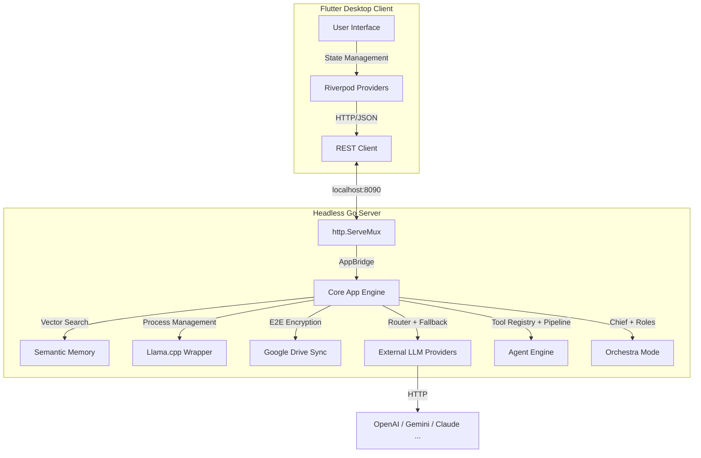

# 🏛️ Architecture

Unlike traditional monolithic applications, Memo is built on a **Decoupled** architecture for high performance and flexibility.

## Core Philosophy: Sovereign Interface
Memo's architecture serves a single principle: **User data stays with the user.** There is no telemetry, no cloud dependency, and no data leakage. The system is designed to work completely offline.

## Inter-Component Communication
The system consists of two main parts that communicate with each other over a standard REST API.

## Module Map
| Module | Directory | Role |
|--------|-----------|------|
| Web Server | `internal/webserver/` | REST API (~45 endpoints) |
| Llama Manager | `internal/llama/` | llama.cpp lifecycle |
| Memory Store | `internal/memory/` | Vector DB (SQLite + sqlite-vec) |
| Cloud Sync | `internal/cloudsync/` | Google Drive E2E backup |
| Identity | `internal/identity/` | System prompt & persona |
| **Providers** | **`internal/provider/`** | **External LLM API integration** |
| **Agent** | **`internal/agent/`** | **Tool calling & permissions** |
| **Orchestra** | **`internal/orchestra/`** | **Multi-model orchestration** |

### Linked Notes:
- [[System Overview]]: General workflow diagram.
- [[Backend (Go) Architecture]]: Modular structure of the backend.
- [[Frontend (Flutter) Design]]: Modern Material 3 interface.
- [[Data Layer and Persistence]]: SQLite/vec0 format and atomic writes.
