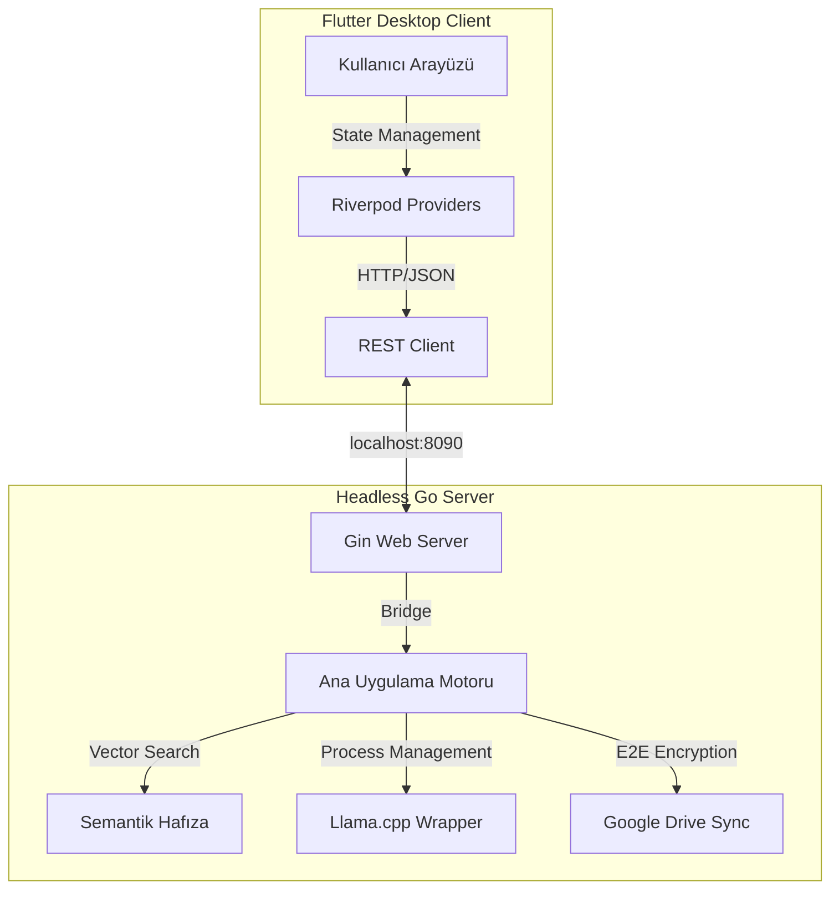

# 🏛️ Mimari Yapı

Memo, geleneksel monolitik uygulamaların aksine, yüksek performans ve esneklik için **Ayrıştırılmış (Decoupled)** bir mimari üzerine inşa edilmiştir.

## Temel Felsefe: Sovereign Interface (Egemen Arayüz)
Memo'nun mimarisi tek bir prensibe hizmet eder: **Kullanıcı verisi kullanıcıda kalır.** Hiçbir telemetri, bulut bağımlılığı veya veri sızıntısı yoktur. Sistem tamamen çevrimdışı (offline) çalışabilecek şekilde tasarlanmıştır.

## Bileşenler Arası İletişim
Sistem iki ana parçadan oluşur ve birbirleriyle standart bir REST API üzerinden haberleşir.

### Bağlantılı Notlar:
- [[Sistem Genel Bakış]]: Genel işleyiş şeması.
- [[Backend (Go) Mimarisi]]: Arka uçtaki modüler yapı.
- [[Frontend (Flutter) Tasarımı]]: Modern Material 3 arayüzü.
- [[Veri Katmanı ve Kalıcılık]]: `.gob` formatı ve atomik yazma.
